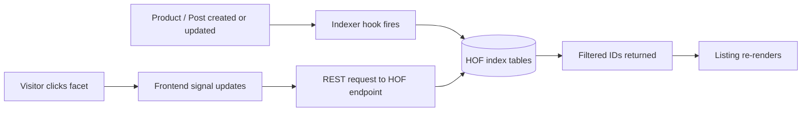

# Core Concepts

A primer on how HOF thinks. Read this once and the rest of the docs make 10x more sense.

## what's a facet?

A **facet** is a single filter dimension. "Price." "Color." "Category." "On sale." It's one axis along which a user can narrow a list.

A **facet set** is a group of facets that work together on a results page. The classic example: a shop sidebar with Price + Color + Size + In Stock.

## indexed vs. live queries

Most cheap filter plugins build their queries on the fly. Every time a user moves a slider, the plugin runs a fresh `WP_Query` with `tax_query` and `meta_query` joins. This is fine for 50 products. It implodes at 5,000.

HOF maintains a **custom index table** that flattens facet data into a fast lookup structure. Filter clicks hit the index, not your products table. You can have 100,000 products and filters still feel instant.

## the data flow

The indexer is **event-driven** — it updates when a product changes, not on a cron. (A scheduled full re-index is available for cases where the event hook misses something.)

## facet types (planned for 1.0)

| Type | Use case |
|---|---|
| [Checkbox](Facet-Type-Checkbox) | Multi-select categories, tags, attributes |
| [Radio](Facet-Type-Radio) | Single-select (rare but useful) |
| [Dropdown](Facet-Type-Dropdown) | Long lists where space matters |
| [Range Slider](Facet-Type-Range-Slider) | Price, weight, numeric meta |
| [Date Range](Facet-Type-Date-Range) | Events, posts by published date |
| [Search](Facet-Type-Search) | Free-text within the result set |
| [Hierarchy](Facet-Type-Hierarchy) | Nested taxonomies (category > sub-category) |
| [Color Swatch](Facet-Type-Color-Swatch) | Variation colors, attribute swatches |
| [Toggle](Facet-Type-Toggle) | Boolean filters ("In stock", "On sale") |

→ Full [Facet Types catalog](Facet-Types) with a decision tree and shared config schema.

## state lives in the URL

Every facet selection updates the URL. That means:

- **Shareable filtered views.** Send a link, get the same filter state.
- **Browser back/forward works.** Like the web should.
- **SEO-friendly.** Crawlers see real URLs, not fragments.

## next reads

- 🏗️ [Architecture](Architecture) — the technical stack
- 👨‍💻 [Developer Guide](Developer-Guide) — hooks, APIs, extending
